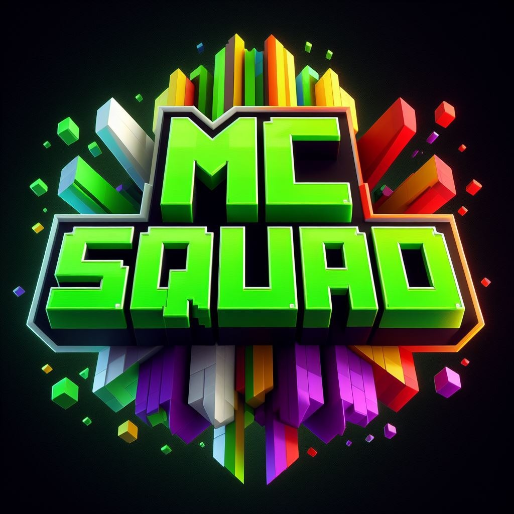

<p align="center"></p>

# MCSquad Dev Launcher

Desktop launcher for MCSquad development environments. It provides Microsoft account authentication, server selection, managed Minecraft/Java setup, mod controls, and automatic launcher updates.

## Requirements

- Node.js 22
- npm

## Local development

```console
npm install
npm start
```

`npm start` launches Electron and is intended for interactive local development. Do not run it in headless verification environments.

## Packaging

Packaging scripts are defined in `package.json`. Release distribution is handled by the repository's existing release workflow; local builds are not a substitute for that workflow.

## Documentation

- [`docs/MicrosoftAuth.md`](docs/MicrosoftAuth.md) — Microsoft Entra application setup.
- [`docs/distro.md`](docs/distro.md) — distribution index reference.
- [`docs/sample_distribution.json`](docs/sample_distribution.json) — sample distribution document.

## Support

Report launcher issues through the repository issue tracker: https://github.com/wally720/MCSquadDev/issues
